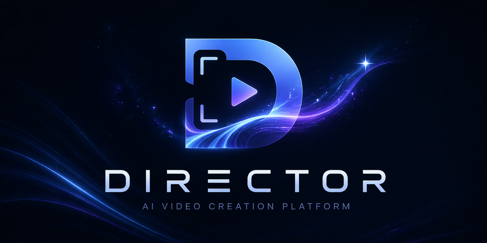

<p align="center">
  
</p>

<h1 align="center">director AI Video Creation Platform</h1>

<p align="center">
  An AI-powered tool for creating short drama / comic videos — automatically generates storyboards, characters, and scenes from novel text, then assembles them into complete videos.
</p>

<p align="center">
  <a href="README.md">中文文档</a> · <a href="https://www.director.com/">Join Waitlist</a> · <a href="https://github.com/saturndec/director/issues">Report Bug</a>
</p>

> [!IMPORTANT]
> **Beta Notice**: This project is currently in its early beta stage. As it is currently a solo-developed project, some bugs and imperfections are to be expected. We are iterating rapidly — please stay tuned for frequent updates! We are committed to rolling out a massive roadmap of new features and optimizations, with the ultimate goal of becoming the top-tier solution in the industry. Your feedback and feature requests are highly welcome!

---

## ✨ Features

- 🎬 **AI Script Analysis** — Parse novels, extract characters, scenes & plot automatically
- 🎨 **Character & Scene Generation** — Consistent AI-generated character and scene images
- 📽️ **Storyboard Video** — Auto-generate shots and compose into complete videos
- 🎙️ **AI Voiceover** — Multi-character voice synthesis
- ⚙️ **Creative Engine** — Connect official services or OpenAI / Gemini compatible services, then choose models per creative workflow
- 🌐 **Bilingual UI** — Chinese / English, switch in the top-right corner

---

## 🚀 Quick Start

**Prerequisites**: Install [Docker Desktop](https://docs.docker.com/get-docker/)

### Method 1: Pull Pre-built Image (Easiest)

No need to clone the repository. Just download and run:

```bash
# Download docker-compose.yml
curl -O https://raw.githubusercontent.com/saturndec/director/main/docker-compose.yml

# Start all services
docker compose up -d
```

> ⚠️ This is a beta version. Database is not compatible between versions. To upgrade, clear old data first:

```bash
docker compose down -v
docker rmi ghcr.io/saturndec/director:latest
curl -O https://raw.githubusercontent.com/saturndec/director/main/docker-compose.yml
docker compose up -d
```

> After starting, please **clear your browser cache** and log in again to avoid issues caused by stale cache.

### Method 2: Clone & Docker Build (Full Control)

```bash
git clone https://github.com/saturndec/director.git
cd director
docker compose up -d
```

To update:
```bash
git pull
docker compose down && docker compose up -d --build
```

### Method 3: Local Development (For Developers)

```bash
git clone https://github.com/saturndec/director.git
cd director

# Copy environment config (must be done before npm install)
cp .env.example .env
# ⚠️ Edit .env to fill in your AI API Keys (NEXTAUTH_URL defaults to http://localhost:3000, no change needed)

npm install

# Start infrastructure only
docker compose up mysql redis minio -d

# Run database migration
npx prisma db push

# Start development server
npm run dev
```

---

Visit [http://localhost:13000](http://localhost:13000) (Method 1 & 2) or [http://localhost:3000](http://localhost:3000) (Method 3) to get started!

> The database is initialized automatically on first launch — no extra configuration needed.

> [!TIP]
> **If you experience lag**: HTTP mode may limit browser connections. Install [Caddy](https://caddyserver.com/docs/install) for HTTPS:
> ```bash
> caddy run --config Caddyfile
> ```
> Then visit [https://localhost:1443](https://localhost:1443)

---

## 🔧 API Configuration

After launching, go to **Settings** to configure creative engines. You can connect built-in official services, or add OpenAI Compatible / Gemini Compatible service URLs and API keys, then choose models for text, image, video, voice, and other workflow steps in **Model Selection**.

> 💡 **Note**: Third-party compatibility layers vary by provider. Before saving, use auto detection or a lightweight text-model check when possible; image, video, voice, and other high-cost models are not called automatically during detection.

---

## 📦 Tech Stack

- **Framework**: Next.js 15 + React 19
- **Database**: MySQL + Prisma ORM
- **Queue**: Redis + BullMQ
- **Styling**: Tailwind CSS v4
- **Auth**: NextAuth.js

---

## 🧭 Developer Docs

- [docs/README.md](docs/README.md) — Chinese developer overview covering runtime, module map, test entry points, and current risk areas
- [Style Management Design](docs/superpowers/specs/2026-05-28-style-management-design.md)
- [Style Prompt Generation Design](docs/superpowers/specs/2026-05-28-style-prompt-generation-design.md)
- [Creative Engine Redesign](docs/superpowers/specs/2026-06-11-creative-engine-redesign.md)

---

## 📦 Preview


---

## 🤝 Contributing

This project is maintained by the core team. You're welcome to contribute by:

- 🐛 Filing [Issues](https://github.com/saturndec/director/issues) — report bugs
- 💡 Filing [Issues](https://github.com/saturndec/director/issues) — propose features
- 🔧 Submitting Pull Requests as references — we review every PR carefully for ideas, but the team implements fixes internally rather than merging external PRs directly

---

**Made with ❤️ by director team**

## Star History

[](https://www.star-history.com/#saturndec/director&type=date&legend=top-left)
